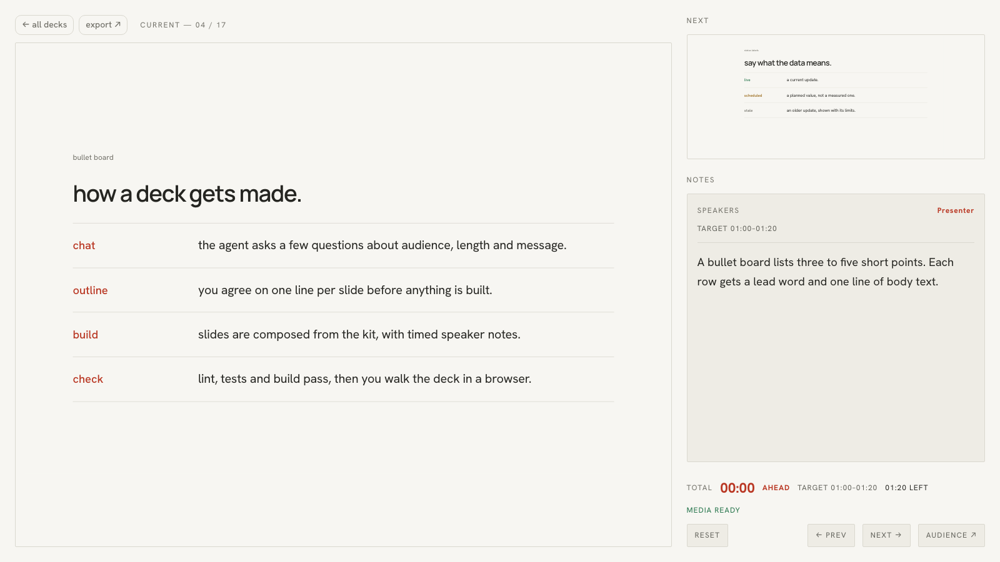

# slide-decks

**Describe your talk to a coding agent and get a real presentation.**

slide-decks is a small React presentation engine built for AI coding agents.
Tell Claude Code, Codex, Cursor, Gemini CLI or Copilot what you're
presenting. The agent asks a few quick questions, agrees an outline with
you, then builds the deck from a layout kit, with timed speaker notes, in
your colours. You present it in the browser, or export it to PDF and PNG.

- **Prompt to deck.** `AGENTS.md` teaches the agent a short workflow: a quick
  chat, a one-line-per-slide outline, the build, and a verification pass.
- **A layout kit, not a blank canvas.** Thirteen layouts: title, section,
  statement, bullets, two columns, timeline, table, stats, terminal, quote,
  image, screenshot pair and closing with QR codes. Custom React slides and
  live [shadcn/ui](https://ui.shadcn.com) controls work too.
- **Your brand.** Keep the default *Daylight* theme, pick the dark
  *midnight* theme, give the agent a palette, or drop a brand kit (logo,
  colours, fonts) into `brand-kit/`. Every theme is checked for WCAG
  contrast.
- **Presenter view.** Current and next slide, speaker notes, a timer that
  knows if you're ahead or behind, and audience windows that stay in sync.
- **Export.** PDF (one 1280×720 page per slide) and PNG per slide, from the
  command line or the browser.



## Quick start

Requires Node.js 22.18 or later.

```sh
git clone https://github.com/immanuel-lam/slide-decks.git
cd slide-decks
npm install
npm run dev
```

Open the URL Vite prints. The index lists every deck. **Kit demo** shows
each layout with sample content.

## Make a deck by prompting

Open the repo in your agent and ask for what you need, for example:

> Make a 10-minute deck for our Q3 team update. Audience is the whole
> company. Use the notes in `~/Desktop/q3.md` and our brand kit.

The agent reads `AGENTS.md`, then:

1. **Quick chat.** Up to five questions (audience, length, the one takeaway,
   your material, the look), each with a default you can accept.
2. **Outline.** One line per slide with its layout and timing. You approve
   it or change it.
3. **Build.** A new folder in `src/decks/<slug>/` with slides, timed notes
   and assets, registered on the index.
4. **Check.** Lint, tests, contrast, notes validation and build must pass.
   Then it looks at the slides.
5. **Hand-off.** How to open the deck, what is still a placeholder, and how
   to export.

The agent will not invent numbers, quotes or logos. Missing content becomes
a visible `[placeholder]` that it lists for you.

| Agent | Reads |
|---|---|
| Codex, and other agents that read AGENTS.md | `AGENTS.md` |
| Claude Code | `CLAUDE.md` → `AGENTS.md` (also the `/new-deck` skill) |
| Gemini CLI | `GEMINI.md` → `AGENTS.md` |
| Cursor | `.cursor/rules/slide-decks.mdc` and `AGENTS.md` |
| GitHub Copilot | `.github/copilot-instructions.md` → `AGENTS.md` |

## Presenting

| Where | What |
|---|---|
| `/#/` | Deck index. Opening a deck starts the presenter view. |
| `/?presenter#/<deck>/1` | Presenter view: current and next slide, notes, timer. Press **AUDIENCE ↗** to open the display window. |
| `/#/<deck>/<n>` | Audience view of slide *n*. |
| `/?export#/<deck>` | Printable view of every slide. |
| `?theme=<name>` | Show any deck in another theme. |

Keys: `→` `Space` `PgDn` next · `←` `Shift+Space` `PgUp` back · `Home` `End`
· `G` or `Esc` for the overview grid. Clicking the left third of a slide goes
back; the rest goes forward. All windows of the same browser stay in step.

## Exporting to PDF and PNG

```sh
npx playwright install chromium          # once
npm run export -- demo                   # exports/demo/demo.pdf + slide-01.png …
npm run export -- demo --png --scale 1   # 1280×720 PNGs only
npm run export -- demo --pdf --theme midnight
npm run export -- --all --out ~/Desktop/decks
```

PNGs are 2560×1440 by default (`--scale 2`). The PDF keeps text as text.
Without the command line, press **export ↗** in the presenter view and use
**print / save as PDF**.

## Themes and brand kits

- **Default:** Daylight, with warm paper, ink and burnt red, set in Manrope
  and Hanken Grotesk. See `docs/DESIGN.md`.
- **Built in:** `midnight`, a dark theme. Use `theme: 'midnight'` in a deck,
  or `?theme=midnight`.
- **Your palette:** tell the agent your colours. It writes
  `src/themes/<name>/theme.css` and runs `npm run check:theme`.
- **Your brand kit:** put a logo, colours, a brand guide and font files you
  are licensed to embed in `brand-kit/`, then ask the agent to make a theme
  from it. Brand files stay out of git; the generated theme doesn't.

To do it by hand, see `src/themes/README.md`.

## Writing a deck by hand

```
src/decks/my-talk-2026-10-01/
  deck.ts            slug, title, date, optional theme and accent
  slides.tsx         slides composed from src/kit
  notes.md           timed speaker notes (optional)
  notes.config.ts    slide count and allowed speakers for the notes
  assets/            images, imported into slides.tsx
```

Copy `src/decks/demo/`, register the deck in `src/decks/index.ts`, and run
`npm run check`. The notes format and the full workflow are in `AGENTS.md`.
The layouts and their props are in `docs/DESIGN.md`.

## Commands

| Command | |
|---|---|
| `npm run dev` | Local dev server |
| `npm run check` | Lint, unit tests, theme contrast, notes validation, type-check and build |
| `npm run test:browser` | Playwright checks (controls, deck switching, presenter sync) |
| `npm run export -- <slug>` | PDF and PNG export |
| `npm run check:theme [-- <name>]` | WCAG contrast check |
| `node scripts/gen-qr.mjs <url> <out.svg>` | QR code for a closing slide |

## Deploying

`npm run build` writes a static site to `dist/`. Routing uses the URL hash,
so any static host works: Vercel, Netlify, Cloudflare Pages or GitHub Pages.
There is no access control. Don't deploy a deck you wouldn't publish, or put
the site behind your host's password protection.

## Examples

- `src/decks/demo` shows every layout, with timed notes.
- `src/decks/arrayah-2026-09-20` is a real six-slide talk about
  [Platform](https://platformtransit.com), a transport app. It is an example
  of a fully custom layout: it authors on its own 1600×900 canvas, scaled
  and scoped, without the kit.

## Stack

Vite, React 19, TypeScript, CSS Modules, Tailwind v4 (for shadcn/ui only),
oxlint, Node's test runner and Playwright. The fonts are Manrope and Hanken
Grotesk from Fontsource, under the SIL Open Font License.

## License

The code is [MIT](LICENSE). The example deck in
`src/decks/arrayah-2026-09-20/`, meaning its text, screenshots and the
Platform icon, is © Immanuel Lam and is not covered by the MIT licence. It is
included as a reference; please don't reuse it.
